# Project 3: UCI & Josh's Madelon Dataset

## Problem Statement

> You're working as a data scientist with a research firm. You're firm is bidding on a big project that will involve working with thousands or possibly tens of thousands of features. You know it will be impossible to use conventional feature selection techniques. You propose that a way to win the contract is to demonstrate a capacity to identify relevant features using machine learning. Your boss says, "Great idea. Write it up." You figure that working with a synthetic dataset such as Madelon is an excellent way to demonstrate your abilities.

Your challenge here is to develop a series of models for two purposes:

1. for the purposes of identifying relevant features. 
2. for the purposes of generating predictions from the model. 

My final product consists of:

1. This prepared report of my findings that detail the accuracy and assumptions of my model
2. A series of Jupyter notebooks to be used to control my pipelines
   
## Bottom Line Up Front
- On the UCI Madelon dataset (hereafter UCI), my best score was *** using ***.  On Josh's Madelon dataset (hereafter DB), I was able to build a model on my sample that scored *** but was unable to run a model on the full dataset

## Project Roadmap

### Attribute Information:

Listing of attributes: 

- `0,1,2...499` for UCI and `0,1,2...999` for DB: a combination of random, redundant, and informative features 
- `500` in UCI and `1000` in DB: target

### Jupyter Notebook Step 0 - EDA
1. Gather and store data. Do substantive work on at least six subsets of the data. 
- 3 sets of 10% of the data from the UCI Madelon set.  
	- This was easy to accomplish - upon loading the data, I pulled 3 samples of 200 and loaded them for processing.  			Initially, since this was 10% of the data, I figured it would be enough, and running some descriptive statistics seemed to bear that out.  This small sample size had consequences down the road when I ran the model benchmarks, which I ultimately solved in notebook 4 by running the whole dataset (more to follow).  This corresponded to a 7% margin of error at 95% confidence.
- 3 sets of 10% of the data from the Madelon set made available by your instructors (20000 rows, 1001 columns).  		
	- This was not as easy to accomplish.  I rapidly ran into the limitations of both AWS and Josh's server as far as what can be downloaded and stored at any given time.  10% is 20,000 rows, but that's 160mb x3, and I also couldn't successfully download more than 5,000 at a time without AWS crashing (a fact I learned through 3 hard boots of AWS).  Ultimately, I ended up pulling 1.5% of the data and randomly split it 3 ways for processing.  This seemed sufficient as far as initial descriptive statistics were concerned, even though it ended up being about 0.5% in each sample (1,000 rows x 1,000 rows = 3 million data points).  This put me in a 3% margin of error range at 95% confidence
- Perform EDA on each set as you see necessary
	- Since there was an extremely poor signal/noise ratio, I ran Josh's R2 method at this stage as my initial form of EDA, even though it's technically feature selection.  I justified this because any sorts of correlation plots or histograms over 500 or 1000 grids did not seem valuable.  I used Josh's R2 feature selection method on both the UCI and DB samples in series, and wrote a function to run each over KNeighborsRegressor and DecisionTreeRegressor and output the lists, which I took the intersection of.  Each output 20 features and agreed on 95% of the features, so I subsequently dropped all but those features from my datasets (with the `_clean` marker appended to the samples)

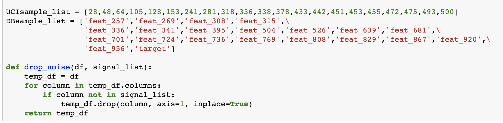

Inline-style: 

1. EDA - data cleaning
    - Column 500 in UCI was NaN - I deleted and filled it with the provided target instead
	- Column 0 in DB was a seemingly meaningless `_id` value that I deleted
1. EDA - statistics
	- Most descriptive statistics at this point provided little insight since the data is opaque and had no real-world meaning.  I was able to use them to ensure that my random samples were sufficiently similar to the original datasets, though.
1. Skew-Normalize & Standardize Data
	- I did not heavily investigate the skew of the data, since it appeared to be generated in a normal way
1. Investigate outliers
	- I did not investigate outliers because I reasoned that both the size and generating method for the data would limit their presence or effect

### Jupyter Notebook Step 1 - Benchmarking
1. I made sure early on that my samples and pipelines could be looped over with the same function across all notebooks, and built pipelines to perform a naive fit for each of the base model classes:
	- logistic regression
	- decision tree
	- k nearest neighbors
	- support vector classifier
# pics 2-4
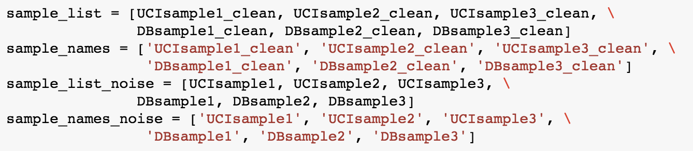
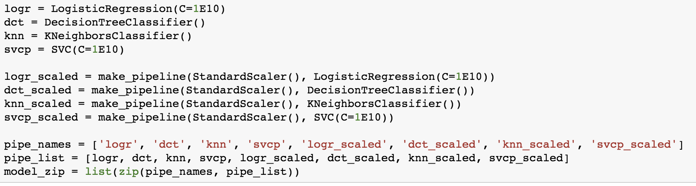
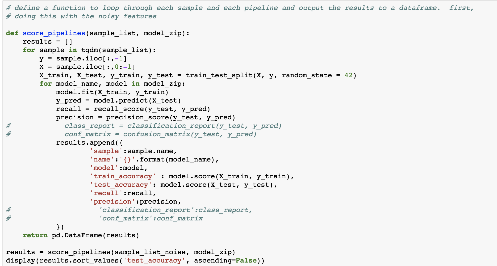

2. The performance metric most valuable here is the test score accuracy.  The train scores for the classifiers at this stage seriously overfit on the benchmark models, especially in samples with the noise (all 500 or 1000 features) compared to the ones that have had Josh's first-pass noise-reduction run on them.  The models, as a result, are only a little better than a coin flip at predicting an outcome on the test split (for most of them).  
	- Of these, KNN and SVC seem to perform the best, getting as high as 70-ish percent in many of the test splits.  On some models, however, SVC often gets worse than a coin flip, giving it high variance

# pics 5-6
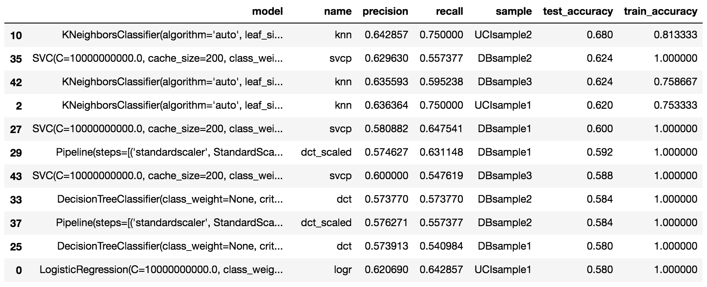
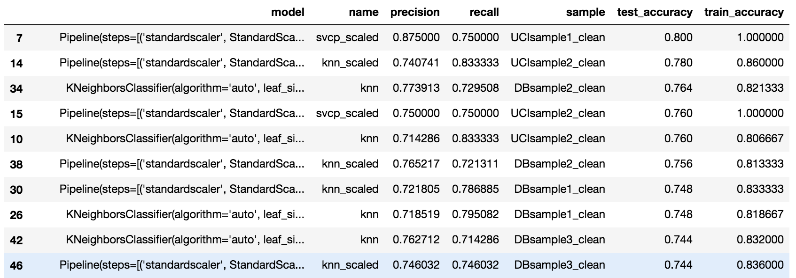

### Jupyter Notebook Step 2 - Identify Features
1. I began with SelectKBest, SelectFromModel, and SelectPercentile as my 3 feature selectors to get from 20 to 5 features.  Using my code and pipelines from the last set allowed me to do this quickly and easily and gridsearch over each model.  I then took the intersection of the lists and graphed values as appropriate (see below)
# pics 7-9
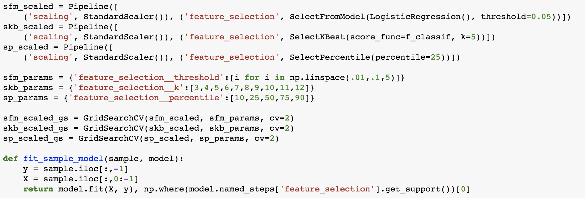
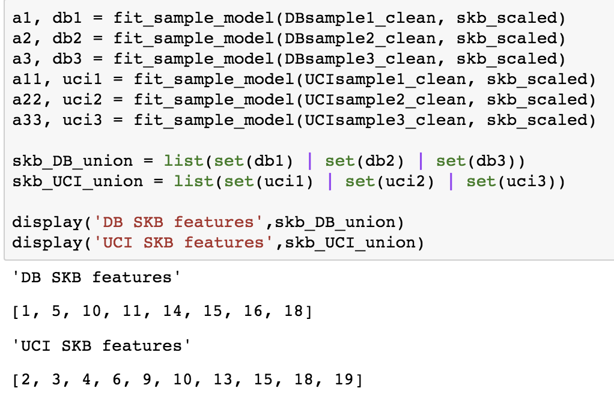
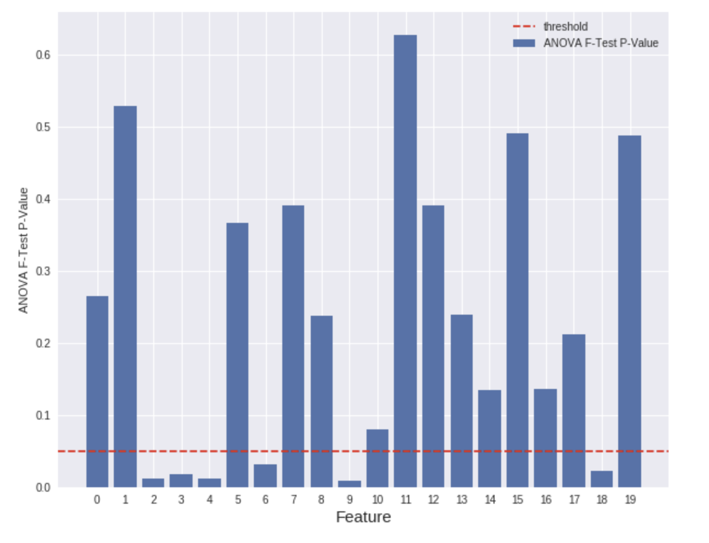

2. Despite extensive tuning, I couldn't get down to less than about 9 or 10 features in both the UCI and DB sets.
# pic 10
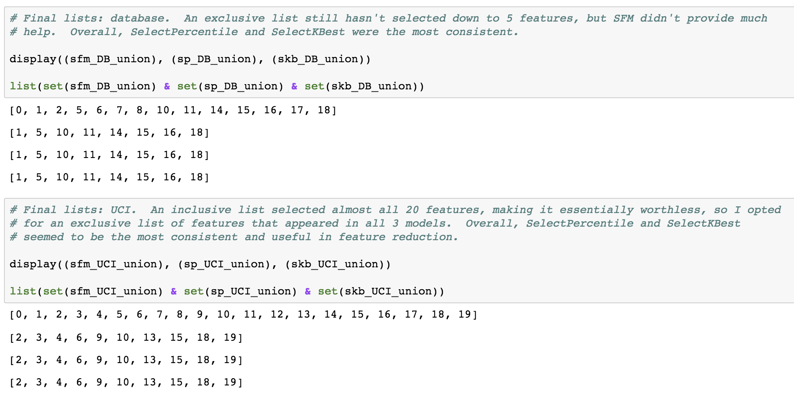
3. I plotted the correlation matrix of these to test redundancy, and while it was pretty good, there was definitely still some left.
# pic 11
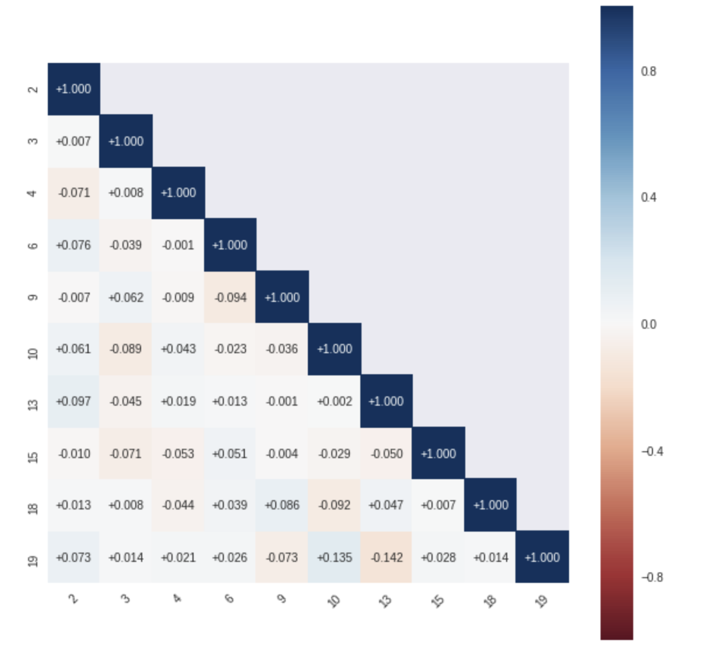

4. Thus, I abandoned these methods in favor of Principal Component Analysis.  Each graph across samples came out as a variation of the below.  I instantly incorporated into all my following pipelines.
# pic 12
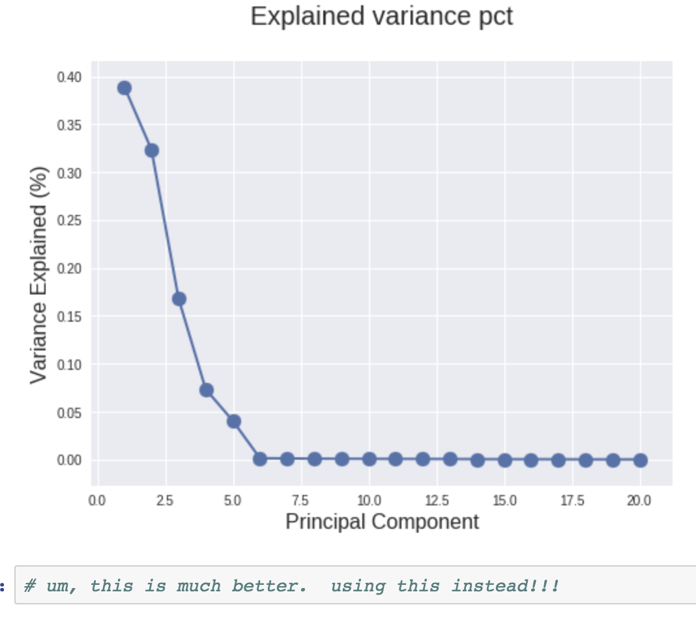

### Jupyter Notebook Step 3 - Testing Model Pipelines
- Considering these results, develop a strategy for building a final predictive model.  Rrecommended approaches:
    - Use feature selection to reduce the dataset to a manageable size then use conventional methods
    - Use dimension reduction to reduce the dataset to a manageable size then use conventional methods
    - Use an iterative model training method to use the entire dataset
- This notebook should be a "playground" where you try various approaches to solving this problem

1. We've already used Josh's method to reduce the noise out of the dataset as part of EDA, and have subsequently run PCA to narrow down to 5 features, which was successful.  Thus, we're doing a version of part 2 above - doing dimension reduction by removing noise, followed by further dimension reduction in PCA (going from 20->5 features).  Conventional methods then follow, including our baseline models and a Bagging, RandomForest, and ExtraTrees model, all of which I gridsearched in this sandbox.  Sadly, initial results were not much better than my benchmark, or were worse in some cases. 
# pics 14-15
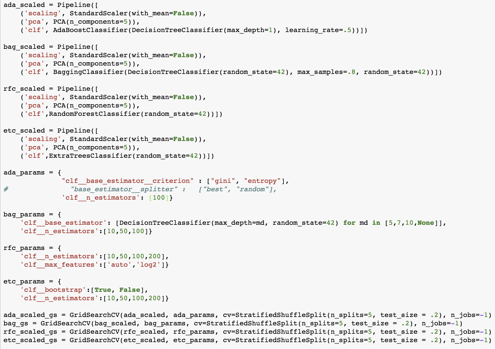
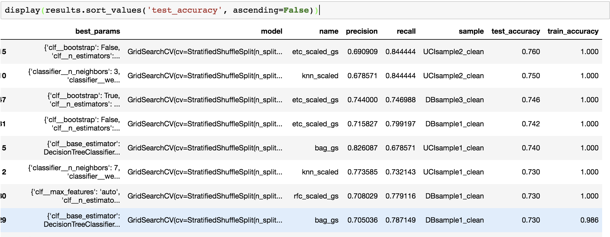

2. At this point, I began to think that this was a result of my sampling from the beginning.  The UCI sets (at 200 apiece) were likely too small to explain a 5D parameter space.  Unsatisfied with my scores at this stage, I moved on to Notebook 4 with the intent of running my model on the full data.

### Jupyter Notebook Step 4 - Build Model
3. Pulling the full data for each model was actually quite simple.  The DB sample was pulled with a SELECT query on our 20 identified critical features (20 cols x 200000 rows = 4 million cells, only marginally more than my original pull). 
# pic 16 
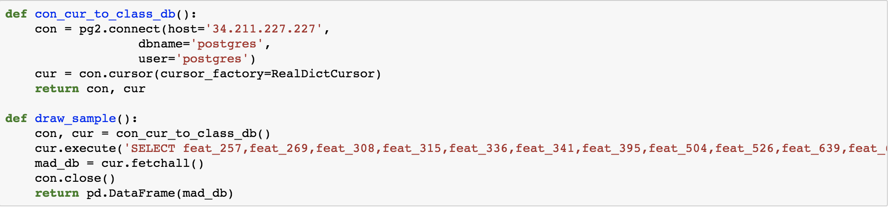

4. Running my models and gridsearching over the same parameters on UCIfull_clean produced a marked improvement in test score, especially with SVC and KNN.  I further improved my score by stratifying at the train_test_split (`stratified=y`) rather than as part of the gridsearch, saving some computation by doing it upfront rather than multiple times during processing.  I also kicked out the lowest-performing models and narrowed the parameter space somewhat to allow for quicker searching
# pics 17-18
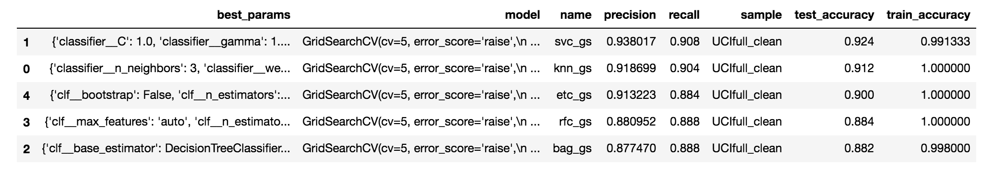
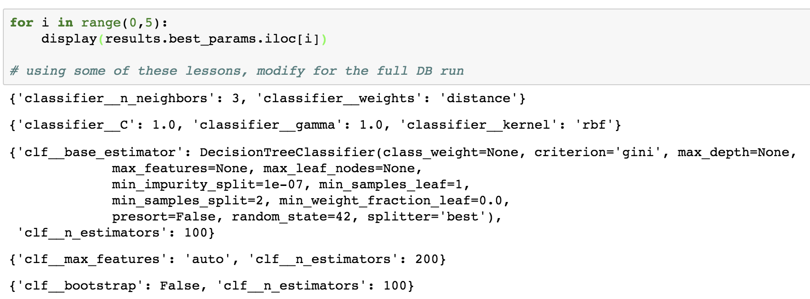

5. And now, the elphant in the room.  Running on this one required even more limiting of models and feature spaces, and several kernel deaths.  I'm sure I could have spent another week optimizing this one.  But in the meantime, I think this is pretty good
# pics 19
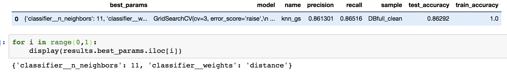

### Stretch Goals

1. Add additional models beyond our 4 baseline models to see if scores improve
1. Operate on full UCI dataset w/ the 20 features
1. Download and operate on full DB dataset w/ the 20 features